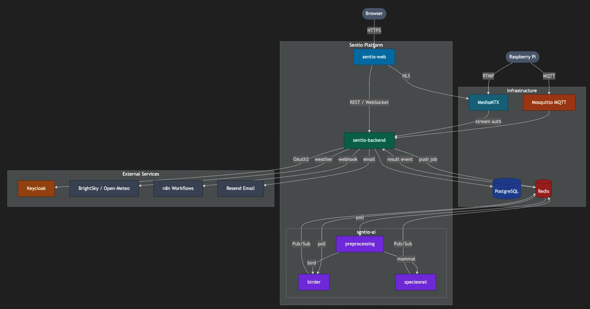

# Sentio Systems Monorepo

[](https://github.com/SentioSystems/sentio-systems/actions)
[](../LICENSE)

Unified repository for the Sentio environmental monitoring platform.

---


## Architecture Overview



[See the architecture documentation.](docs/architecture/architecture.md)

---

## Quick Start

Clone the repository and start all services with Docker Compose:

```sh
git clone https://github.com/SentioSystems/sentio-systems.git
cd sentio-systems
docker compose up --build
```

See each component's README for local development and advanced usage.

---

## Components

- [sentio-backend](sentio-backend/README.md): Spring Boot REST API for data processing and IoT management
- [sentio-ai](sentio-ai/README.md): ML models for species detection and weather prediction
- [sentio-embedded](sentio-embedded/README.md): Embedded firmware for AI wildlife monitoring
- [sentio-frontend-new](sentio-frontend-new/README.md): New web dashboard (React)
- [n8n-workflows](n8n-workflows/README.md): Workflow automations
- [init-scripts](init-scripts/README.md): Infrastructure initialization scripts
- [docs](docs/README.md): Documentation, ADRs, and architecture
- [sentio-web](sentio-web/README.md): (Deprecated) Old web dashboard

---

## Deployment Overview

Sentio Systems is designed for modular deployment using Docker Compose. Each component can also be run and developed independently. See the [Makefile](Makefile) and each component's README for details.

---

## Documentation

We document significant architectural decisions in this repository using **Architecture Decision Records (ADRs)**. You can find the history of decisions and their rationale in the [docs/adr/](docs/adr/README.md) directory.

- [Architecture Decision Records (ADRs)](docs/adr/README.md)
- [Git Workflow & Branching Strategy](docs/git-workflow.md)
- [Architecture Documentation](docs/architecture/architecture.md)