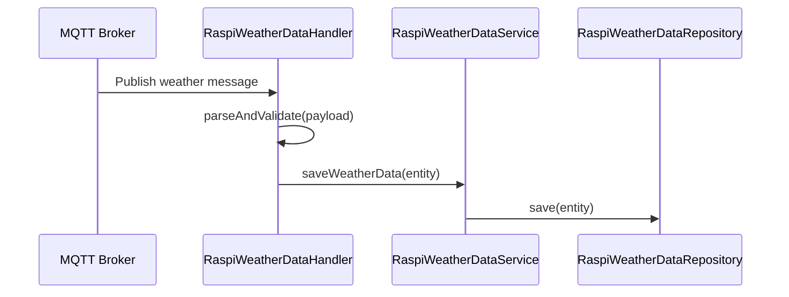
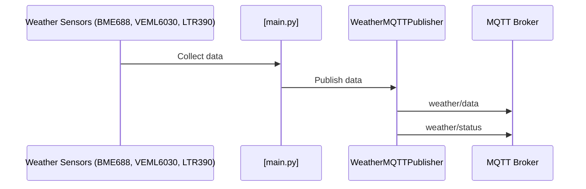
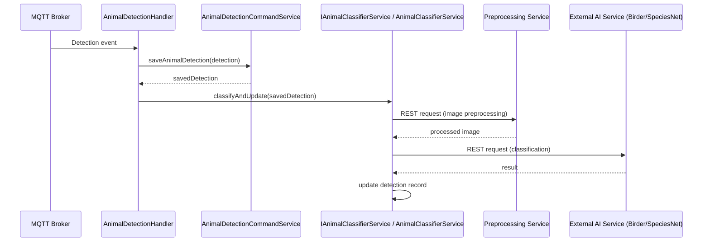
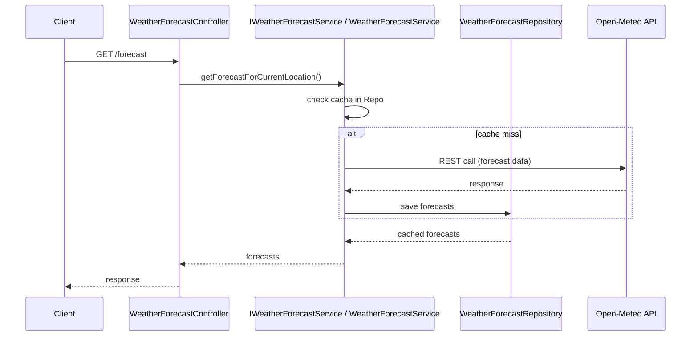

# Component Communication Documentation

## Overview
This document describes how backend components communicate with each other and with external services. It covers synchronous and asynchronous communication patterns, MQTT message flows, REST-based integrations, error handling strategies, and retry/fallback mechanisms.

The system integrates multiple external services (MQTT brokers, weather APIs, and AI services) and therefore requires clear communication contracts and robust error handling.

---

## Refactoring Impact on Communication Contracts

Recent backend refactoring introduced interface-based service contracts and stricter separation of concerns. Communication behaviour is unchanged at API level, but internal coupling is reduced.

### Interface-Based Service Contracts

Controllers now depend on service interfaces (for example `IWeatherForecastService`, `IHistoricalWeatherService`, `IAnimalClassifierService`, `IBrightSkyService`) instead of concrete classes.

**Impact on communication:**
- Request/response contracts at REST and MQTT boundaries remain stable
- Internal component communication is more replaceable and testable
- Service implementations can be swapped without changing controller-layer contracts

### Classification Flow Strategy

Animal classification uses a processor strategy (factory + processors) for type-specific behaviour.

**Impact on communication:**
- Classification orchestration remains a single backend entry flow
- Animal-type specific handling is delegated to dedicated processors
- External preprocessing/AI calls remain encapsulated behind service boundaries

### SOLID Alignment (Communication-Relevant)

- **Dependency Inversion:** controllers communicate with interfaces, not implementations
- **Interface Segregation:** focused interfaces reduce unnecessary cross-component dependencies
- **Single Responsibility:** communication parsing, orchestration, and persistence are separated into dedicated components

---

## Communication Patterns

### Synchronous Communication

Synchronous Communication is used when an immediate response is required before proceeding.

**Technologies used:**
- REST (HTTP/JSON)
- Spring `@RestController`
- `RestTemplate` for outbound calls

**Typical use cases:**
- Client → Backend REST endpoints
- Service → External API (BrightSky, Birder AI, SpeciesNet)
- Internal service-to-service calls with immediate results

**Characteristics:**
- Blocking request/response
- Easier error propagation
- Simpler control flow
- Enforced authentication/authorization on protected endpoints
- Request payload validation before service-level processing

### Asynchronous Communication

Asynchronous communication allows the sender to continue processing without waiting for a response.

**Technologies used:**
- MQTT (publish/subscribe)
- Spring `@Async`
- Message-driven service handlers

**Typical use cases:**
- Weather sensor data ingestion
- Animal detection events
- AI classification tasks

**Characteristics:**
- Non-blocking
- Higher resilience
- Consistency
- Fault isolation for background classification and ingestion workflows

---

## Security Controls in Communication Paths

Security controls are applied on top of communication patterns to protect data flows and service boundaries.

### REST Communication Security

- Role-based access control (RBAC) is enforced at protected API boundaries
- Bean validation (`@Valid` and DTO constraints) is used for inbound request validation
- CORS policy is centrally configured and restricted
- Security-relevant events are logged with structured logging practices

### MQTT Communication Security

- MQTT transport is expected to use TLS in production environments
- Broker authentication settings are supported and should be enabled in deployment configuration
- Message handlers validate payloads and discard malformed data early

### CI/CD and Compliance Guardrails

- Security scanning is integrated into CI/CD quality gates
- Documentation and threat-model/audit artifacts are part of compliance evidence

---

## MQTT Communication

### MQTT Topic Structure

```
device/{deviceId}/status: For publishing device status updates (e.g., online/offline, battery level)
device/{deviceId}/weather: For publishing weather sensor data (e.g., temperature, humidity)
device/{deviceId}/animal/detection: For publishing animal detection events (e.g., image URLs, timestamps)
device/{deviceId}/location: For publishing GPS location updates.
device/{deviceId}/command: For subscribing to backend commands (e.g., configuration changes)
```

### Message Formats

#### Weather Data Message
```json
{
  "device_id": "device-123",
  "location": "garden",
  "timestamp": "2026-01-10T12:00:00",
  "temperature": 4.2,
  "humidity": 87.0,
  "pressure": 1013.5,
  "lux": 1500.0,
  "uvi": 2.5,
  "gas_resistance": 50000
}
```

#### Embedded Weather Data Message
```json
{
  "device_id": "weather_station",
  "location": "garden",
  "timestamp": "2026-01-10T12:00:00Z",
  "temperature": 4.2,
  "humidity": 67,
  "pressure": 1013.5,
  "lux": 1500,
  "uvi": 2.5
}
```

#### Animal Detection Message
```json
{
  "timestamp": "2026-01-10T12:05:00",
  "imageUrl": "https://camera.local/image.jpg",
  "deviceId": "device-123",
  "location": "garden",
  "triggerReason": "motion",
  "detections": [
    {
      "animal_type": "bird",
      "confidence": 0.95,
      "bbox": [100, 200, 150, 250]
    }
  ]
}
```

---

## Main Workflows

### 1. MQTT Weather Data Ingestion
**Description:**
Weather data is published by Raspberry Pi devices via MQTT and stored in the database.



**Notes:**
- Entire flow is asynchronous
- Validation errors are logged and discarded

---

### 2. Embedded Weather Data Ingestion
**Description:**
Weather data is collected from sensors on the embedded device and published via MQTT.



**Notes:**
- Runs on Raspberry Pi with Python
- Publishes every 5 minutes by default
- Includes GPS location if available

---

### 3. Animal Detection and AI Classification Flow
**Description:**
Animal detection events trigger asynchronous AI classification using external services.



**Notes:**
- Asynchronous via `@Async` in `AnimalClassifierService.classifyAndUpdate()`
- Preprocessing service is called first for image preparation
- Failures log errors but don't block; detection is saved initially
- Classification behaviour is delegated internally via processor strategy (factory + processors)

---

### 4. Weather Forecast Retrieval and Caching
**Description:**
Weather forecasts are retrieved synchronously from the Open-Meteo API and cached.



**Notes:**
- Synchronous REST communication
- Caches in `WeatherForecastRepository` to reduce API calls
- Uses device location from `DeviceLocationService`
- Controller-to-service contract is interface-based after refactoring
- Weather alerts are handled separately via `IBrightSkyService`/`BrightSkyService`

## @Async Processing

`AnimalClassifierService` uses Spring's `@Async` annotation:

### Method Annotation
- The `classifyAndUpdate` method is marked with `@Async`
- Through this, it gets executed in a separate thread managed by Spring's task executor
- Allows the caller to continue processing while the method runs

### Purpose
- The method handles animal species classification by calling external preprocessing and AI services with HTTP requests
- Asynchronous Processing prevents main application thread from being blocked during I/O operations like network calls

### Execution Flow
- Calling `classifyAndUpdate` returns immediate control to the caller
- The method runs in the background
- Performs image validation, sends the image to the preprocessing service, processes the response, and updates the database
- Main thread isn't blocked

### Error Handling
- Exceptions within the async method are logged
- They do not propagate back to the caller
- Method returns `void`

---

## Error Handling Strategies

### Backend

#### Exception Logging and Non-Blocking Processing
- Critical operations like MQTT message handling in `RaspiWeatherDataHandler` and AI classification in `AnimalClassifierService` use try/catch blocks
- Errors are logged with details but do not stop program execution
- Invalid messages are discarded
- Async tasks continue without propagating exceptions back to callers

#### Validation and Early Returns
- Input validation (for example required fields in weather data) prevents malformed payloads
- Warnings get logged
- Graceful exit

#### Security Enforcement at Boundaries
- Protected REST endpoints require valid authentication/authorization
- Inbound REST payloads are validated before business logic execution
- MQTT payloads are validated and rejected when malformed

#### Resilience Patterns
**Circuit Breakers**:
- Are applied to external integrations using Resilience4j (for example weather APIs)
- If failures exceed thresholds, requests fall back to safe behaviour (for example cached or empty responses)
- Warnings are logged and cascading failures are limited

**Async Error Isolation**:
- `@Async` methods run in background threads
- Exceptions logged locally, don't affect main flow
- As described in the paragraph Error Handling under @AsyncProcessing

### Embedded

#### Sensor and Hardware Resilience
- In `weather_sensors.py` and `main.py`, try-except blocks handle sensor initialization failures
- Logs errors and continues with available sensors

#### Graceful Degradation
- GPS or sensor reading failures are caught
- Get logged and retried in background threads
- Doesn't stop data collection

#### Configuration Loading
- Try-except for YAML config parsing
- Fallbacks to default and error logging

### AI Services

#### Preprocessing and Classification
- Similar to embedded code, try-except around image processing and API calls
- Logging for failures, continuation of workflow

### Frontend

#### HTTP Error Handling
Axios interceptors manage API responses:
- Automatic token refresh on 401 errors
- Queueing failed requests during refresh
- Redirect to login on refresh failures

#### No Explicit Try-Catch in Components
- Relies on framework-level error boundaries (aren't visible in the code)
- Service-layer handling for user-facing errors

### Overall Strategies / Error Handling Summary

#### Logging Centric
- Errors are primarily logged with SLF4J rather than thrown
- Ensures that the system remains operational for IoT deployment

#### Retry and Fallback
- Circuit breakers and async isolation prevent cascading failures
- External API calls use caching or skip on errors

#### Validation Over Crashing
Strict input checks avoid downstream issues

#### No Global Error Recovery
Failures in non-critical paths don't block core functionalities like data ingestion

---

## Summary

The backend uses a mix of synchronous and asynchronous communication tailored to each use case. MQTT enables decoupled event-driven ingestion, while REST is used for request-driven operations and external integrations. After refactoring, component interactions are interface-based and more testable without changing external contracts. Security controls (RBAC, validation, CORS hardening, secure MQTT configuration, and CI security gates) are integrated into communication boundaries to support resilience, maintainability, and compliance.