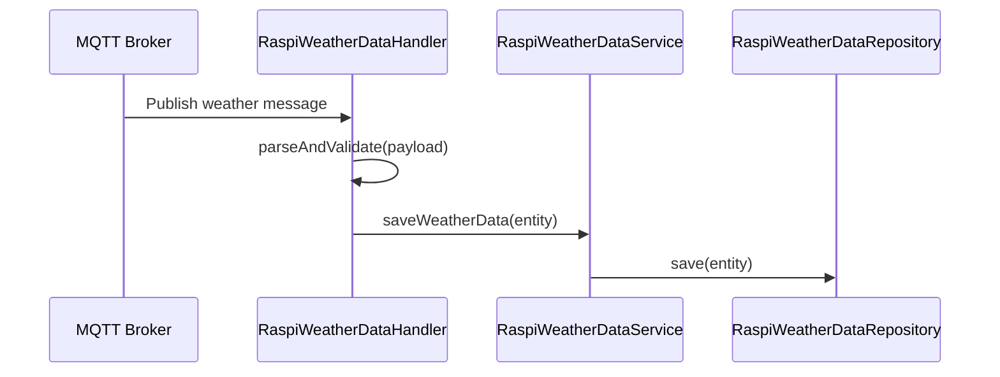
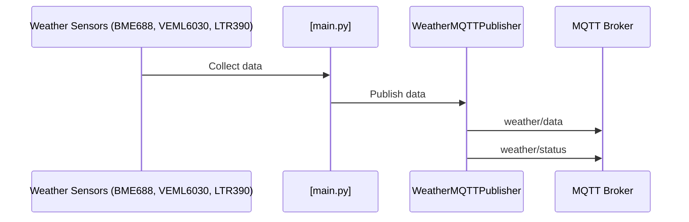
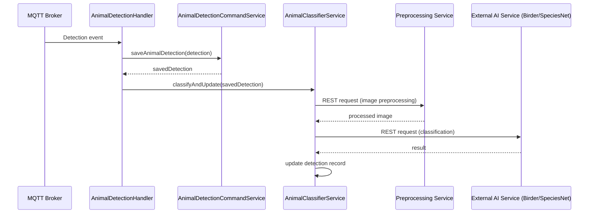
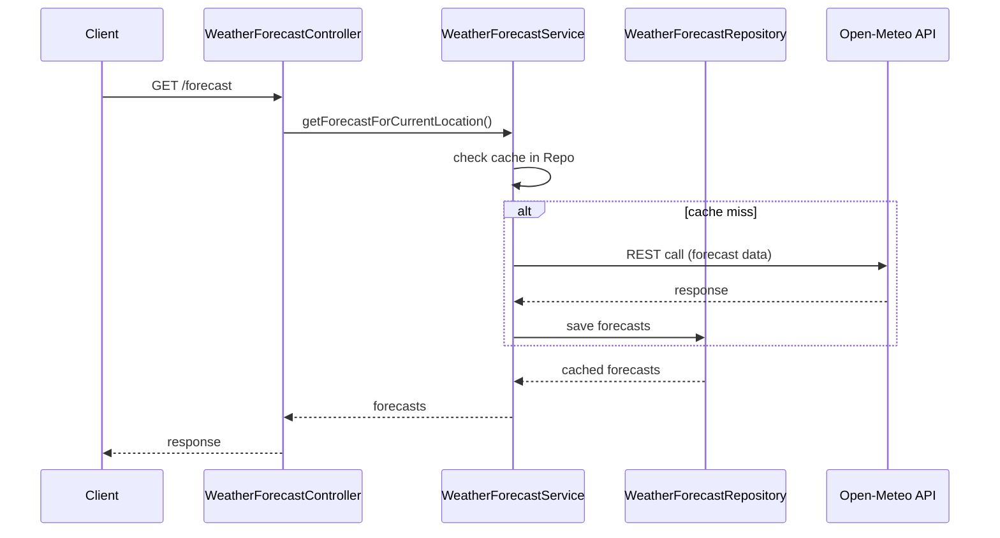

# Component Communication Documentation

## Overview
This document describes how backend components communicate with each other and with external services. It covers synchronous and asynchronous communication patterns, MQTT message flows, REST-based integrations, error handling strategies, and retry/fallback mechanisms.

The system integrates multiple external services (MQTT brokers, weather APIs, and AI services) and therefore requires clear communication contracts and robust error handling.

---

## Communication Patterns

### Synchronous Communication

Synchronous Communication is used when an immediate response is required before proceeding.

**Technologies used:**
- REST (HTTP/JSON)
- Spring `@RestController`
- `RestTemplate` for outbound calls

**Typical use cases:**
- Client → Backend REST endpoints
- Service → External API (BrightSky, Birder AI, SpeciesNet)
- Internal service-to-service calls with immediate results

**Characteristics:**
- Blocking request/response
- Easier error propagation
- Simpler control flow

### Asynchronous Communication

Asynchronous communication allows the sender to continue processing without waiting for a response.

**Technologies used:**
- MQTT (publish/subscribe)
- Spring `@Async`
- Message-driven service handlers

**Typical use cases:**
- Weather sensor data ingestion
- Animal detection events
- AI classification tasks

**Characteristics:**
- Non-blocking
- Higher resilience
- Consistency

---

## MQTT Communication

### MQTT Topic Structure

```
device/{deviceId}/status: For publishing device status updates (e.g., online/offline, battery level)
device/{deviceId}/weather: For publishing weather sensor data (e.g., temperature, humidity)
device/{deviceId}/animal/detection: For publishing animal detection events (e.g., image URLs, timestamps)
device/{deviceId}/location: For publishing GPS location updates.
device/{deviceId}/command: For subscribing to backend commands (e.g., configuration changes)
```

### Message Formats

#### Weather Data Message
```json
{
  "device_id": "device-123",
  "location": "garden",
  "timestamp": "2026-01-10T12:00:00",
  "temperature": 4.2,
  "humidity": 87.0,
  "pressure": 1013.5,
  "lux": 1500.0,
  "uvi": 2.5,
  "gas_resistance": 50000
}
```

#### Embedded Weather Data Message
```json
{
  "device_id": "weather_station",
  "location": "garden",
  "timestamp": "2026-01-10T12:00:00Z",
  "temperature": 4.2,
  "humidity": 87,
  "pressure": 1013.5,
  "lux": 1500,
  "uvi": 2.5
}
```

#### Animal Detection Message
```json
{
  "timestamp": "2026-01-10T12:05:00",
  "imageUrl": "https://camera.local/image.jpg",
  "deviceId": "device-123",
  "location": "garden",
  "triggerReason": "motion",
  "detections": [
    {
      "animal_type": "bird",
      "confidence": 0.95,
      "bbox": [100, 200, 150, 250]
    }
  ]
}
```

---

## Main Workflows

### 1. MQTT Weather Data Ingestion
**Description:**
Weather data is published by Raspberry Pi devices via MQTT and stored in the database.



**Notes:**
- Entire flow is asynchronous
- Validation errors are logged and discarded

---

### 2. Embedded Weather Data Ingestion
**Description:**
Weather data is collected from sensors on the embedded device and published via MQTT.



**Notes:**
- Runs on Raspberry Pi with Python
- Publishes every 5 minutes by default
- Includes GPS location if available

---

### 3. Animal Detection and AI Classification Flow
**Description:**
Animal detection events trigger asynchronous AI classification using external services.



**Notes:**
- Asynchronous via @Async in `AnimalClassifierService.classifyAndUpdate()`
- Preprocessing service is called first for image preperation
- Failures log errors but don't block; detection is saved initially

---

### 4. Weather Forecast Retrieval and Caching
**Description:**
Weather forecasts are retrieved synchronously from the BrightSky API and cached.



**Notes:**
- Synchronous REST communication
- Caches in `WeatherForecastRepository` to reduce API calls
- Uses device location from `DeviceLocationService`

## @Async Processing

`AnimalClassifierService` uses Spring's `@Async` annotation:

### Method Annotation
- The `classifyAndUpdate` method is marked with `@Async`
- Through this, it gets executed in a seperate thread manager by Spring's task executor
- Allows the caller to cintinue processing while the method runs

### Purpose
- The method handles animal species classification by calling external preprocessing and AI services with HTTP requests
- Asynchronous Processing prevents main application thread from being blocked during I/O operations like network calls

### Execution Flow
- Calling `classifyAndUpdate` returns immediate control to the caller
- The method runs in the background
- Performs image validation, send image to the preprocessing service, processes the response and updates the database
- Main thread isn't blocked

### Error Handling
- Exceptions withing the async method are logged
- Don't propagate back to the caller
- Method returns `void`

---

## Error Handling Strategies

### Async Processing
- As described in the paragraph Error Handling under @AsyncProcessing

---

## Summary

The backend uses a mix of synchronous and asynchronous communication tailored to each use case. MQTT enables decoupled event-driven ingestion, while REST is used for request-driven operations and external integrations. Robust error handling and clear communication boundaries ensure system resilience and maintainability.