# Sentio Database Schema Documentation

This document describes the database schema for the Sentio backend, including entity relationships, constraints, and indexes.

## Entity Relationship Diagram

```mermaid
erDiagram
    devices ||--o{ animal_detections : "has"
    devices ||--o{ weather_forecasts : "has"
    devices ||--o{ historical_weather : "has"
    devices ||--o{ weather_alerts : "has"
    devices ||--o{ location_data : "has"
    devices ||--o{ raspi_weather_data : "has"
    
    devices {
        varchar id PK "UUID, 100 chars"
        varchar name "Device name"
        varchar owner_id "FK User owner"
        timestamp created_at "Creation time"
        varchar ip_address "Device IP"
        double latitude "GPS latitude"
        double longitude "GPS longitude"
        boolean is_primary "Primary device flag"
        timestamp last_seen "Last activity"
        boolean stream_active "Video stream status"
    }
    
    animal_detections {
        bigserial id PK
        varchar device_id FK "→ devices.id"
        varchar species "Detected species"
        varchar animal_type "bird or mammal"
        real confidence "0.0 - 1.0"
        real x "Bounding box X"
        real y "Bounding box Y"
        real width "Bounding box width"
        real height "Bounding box height"
        varchar image_url "Detection image"
        timestamp timestamp "Detection time"
        varchar location "Location name"
    }
    
    weather_forecasts {
        bigserial id PK
        varchar device_id FK "→ devices.id"
        date forecast_date "Forecast date"
        timestamp forecast_date_time "Exact forecast time"
        real temperature "Celsius"
        real humidity "Percentage"
        real pressure "hPa"
        real wind_speed "m/s"
        varchar city "City name"
        varchar country "Country"
        real latitude "Latitude"
        real longitude "Longitude"
    }
    
    historical_weather {
        bigserial id PK
        varchar device_id FK "→ devices.id"
        date weather_date "Historical date"
        real max_temperature "Daily max °C"
        real min_temperature "Daily min °C"
        real precipitation_sum "Total mm"
        real wind_speed_max "Max m/s"
        varchar city "City"
        varchar country "Country"
    }
    
    weather_alerts {
        bigserial id PK
        varchar device_id FK "→ devices.id"
        varchar alert_id UK "Unique CAP ID"
        varchar severity "minor/moderate/severe"
        varchar urgency "immediate/future"
        timestamp effective "Alert start"
        timestamp expires "Alert end"
        text headline_en "English headline"
        text description_en "English description"
        real latitude "Alert center lat"
        real longitude "Alert center lon"
    }
    
    location_data {
        bigserial id PK
        varchar device_id FK "→ devices.id"
        varchar ip_address "Source IP"
        varchar city "City name"
        varchar country "Country"
        varchar region "Region/state"
        real latitude "Latitude"
        real longitude "Longitude"
        varchar timezone "IANA timezone"
    }
    
    raspi_weather_data {
        bigserial id PK
        varchar device_id FK "→ devices.id"
        real temperature "Sensor °C"
        real humidity "Sensor %"
        real pressure "Sensor hPa"
        real lux "Light intensity"
        real uvi "UV index"
        timestamp timestamp "Reading time"
    }
    
    weather_radar_metadata {
        bigserial id PK
        varchar dwd_timestamp UK "DWD timestamp"
        varchar precipitation_type "rain/snow/etc"
        varchar file_url "Radar image URL"
        timestamp created_at "Import time"
    }
    
    workflow_results {
        bigserial id PK
        varchar workflow_type "Workflow category"
        varchar workflow_url "Endpoint URL"
        varchar status "pending/success/failed"
        text payload "Request payload"
        text response "Response data"
        timestamp created_at "Creation time"
        timestamp completed_at "Completion time"
    }
```



## Table Descriptions

### devices
Central table for IoT device registration and management.

| Column | Type | Constraints | Description |
|--------|------|-------------|-------------|
| id | VARCHAR(100) | PRIMARY KEY | Unique device UUID |
| name | VARCHAR(255) | NOT NULL | Human-readable device name |
| owner_id | VARCHAR(255) | NOT NULL | User ID who owns device |
| created_at | TIMESTAMP | NOT NULL | Device registration time |
| latitude | DOUBLE | - | GPS latitude coordinate |
| longitude | DOUBLE | - | GPS longitude coordinate |
| is_primary | BOOLEAN | DEFAULT FALSE | Primary device for user |
| last_seen | TIMESTAMP | - | Last activity timestamp |

### animal_detections
Stores AI-detected animals from device cameras.

| Column | Type | Constraints | Description |
|--------|------|-------------|-------------|
| id | BIGSERIAL | PRIMARY KEY | Auto-increment ID |
| device_id | VARCHAR(100) | FK → devices | Source device |
| species | VARCHAR(255) | NOT NULL | Detected species name |
| animal_type | VARCHAR(255) | NOT NULL | "bird" or "mammal" |
| confidence | REAL | NOT NULL | Detection confidence (0-1) |
| timestamp | TIMESTAMP | NOT NULL | Detection time |
| image_url | VARCHAR(500) | - | Link to detection image |

### weather_forecasts
Hourly weather predictions from OpenMeteo API.

| Column | Type | Constraints | Description |
|--------|------|-------------|-------------|
| id | BIGSERIAL | PRIMARY KEY | Auto-increment ID |
| device_id | VARCHAR(100) | FK → devices | Associated device |
| forecast_date_time | TIMESTAMP | NOT NULL, UNIQUE with device_id | Forecast target time |
| temperature | REAL | - | Predicted temperature °C |
| humidity | REAL | - | Predicted humidity % |
| city | VARCHAR(255) | - | Forecast location city |

### historical_weather
Past weather data for trend analysis.

| Column | Type | Constraints | Description |
|--------|------|-------------|-------------|
| id | BIGSERIAL | PRIMARY KEY | Auto-increment ID |
| device_id | VARCHAR(100) | FK → devices | Associated device |
| weather_date | DATE | NOT NULL, UNIQUE with device_id | Historical date |
| max_temperature | REAL | - | Daily max temperature |
| min_temperature | REAL | - | Daily min temperature |

### weather_alerts
DWD weather warnings and alerts.

| Column | Type | Constraints | Description |
|--------|------|-------------|-------------|
| id | BIGSERIAL | PRIMARY KEY | Auto-increment ID |
| alert_id | VARCHAR(255) | UNIQUE, NOT NULL | CAP message identifier |
| device_id | VARCHAR(100) | FK → devices | Associated device |
| severity | VARCHAR(50) | - | minor/moderate/severe/extreme |
| effective | TIMESTAMP | NOT NULL | Alert start time |
| expires | TIMESTAMP | - | Alert expiry time |

### raspi_weather_data
Real-time sensor readings from Raspberry Pi devices.

| Column | Type | Constraints | Description |
|--------|------|-------------|-------------|
| id | BIGSERIAL | PRIMARY KEY | Auto-increment ID |
| device_id | VARCHAR(100) | FK → devices | Source device |
| temperature | REAL | NOT NULL | BME688 temperature |
| humidity | REAL | NOT NULL | BME688 humidity |
| pressure | REAL | NOT NULL | BME688 pressure |
| lux | REAL | NOT NULL | Light sensor reading |
| uvi | REAL | NOT NULL | UV index |
| timestamp | TIMESTAMP | NOT NULL | Reading timestamp |

## Indexes

### Performance Indexes

| Table | Index Name | Columns | Purpose |
|-------|------------|---------|---------|
| animal_detections | idx_detection_device | device_id | Device filtering |
| animal_detections | idx_detection_device_time | device_id, timestamp DESC | Recent detections per device |
| weather_forecasts | idx_forecast_device | device_id | Device filtering |
| weather_forecasts | idx_forecast_device_date | device_id, forecast_date | Date range queries |
| raspi_weather_data | idx_weather_data_device_time | device_id, timestamp DESC | Recent sensor data |
| weather_alerts | idx_alert_device_active | device_id, expires | Active alerts lookup |
| historical_weather | idx_historical_device_date | device_id, weather_date | Date range queries |

### Unique Indexes

| Table | Index Name | Columns | Purpose |
|-------|------------|---------|---------|
| weather_forecasts | idx_forecast_unique | forecast_date_time, device_id | Prevent duplicate forecasts |
| weather_alerts | idx_alert_unique | alert_id | Unique alert identifier |
| weather_radar_metadata | idx_radar_dwd_timestamp | dwd_timestamp | Unique radar images |

## Foreign Key Relationships

All data tables reference the `devices` table via `device_id`:

```
devices.id (PK)
    ├── animal_detections.device_id (FK, ON DELETE SET NULL)
    ├── weather_forecasts.device_id (FK, ON DELETE CASCADE)
    ├── historical_weather.device_id (FK, ON DELETE CASCADE)
    ├── weather_alerts.device_id (FK, ON DELETE CASCADE)
    ├── location_data.device_id (FK, ON DELETE SET NULL)
    └── raspi_weather_data.device_id (FK, ON DELETE SET NULL)
```

**Delete Behavior:**
- **CASCADE**: Weather data is deleted when device is removed (forecasts, historical, alerts)
- **SET NULL**: Detection and sensor data preserved for historical analysis

## Schema Evolution

### Migration Strategy

Using **Flyway** for version-controlled migrations:

```
src/main/resources/db/migration/
├── V1__initial_schema.sql    # Current schema
├── V2__add_feature.sql       # Future migrations
└── V3__modify_column.sql
```

### Naming Convention

- `V{version}__{description}.sql` - Versioned migrations
- `R__{description}.sql` - Repeatable migrations (views, functions)

### Adding New Migrations

1. Create new file: `V{next_version}__{description}.sql`
2. Write SQL DDL statements
3. Flyway applies automatically on startup
4. JPA validates entity mappings

## Database Configuration

### Production (PostgreSQL)

```properties
spring.datasource.url=jdbc:postgresql://localhost:5432/sentio
spring.jpa.hibernate.ddl-auto=validate
spring.flyway.enabled=true
```

### Development (PostgreSQL + Demo Data)

```bash
./mvnw spring-boot:run -Dspring-boot.run.profiles=dev
```

### Testing (H2 In-Memory)

```properties
spring.datasource.url=jdbc:h2:mem:testdb;MODE=PostgreSQL
spring.jpa.hibernate.ddl-auto=create-drop
spring.flyway.enabled=false
```

## Data Seeding

### Demo Data (Dev Profile)

Activate with: `--spring.profiles.active=dev`

Seeded data:
- 3 devices with locations
- 84 weather forecasts (7 days × 4/day × 3 devices)
- 90 historical weather records (30 days × 3 devices)
- 30 animal detections (birds and mammals)
- 3 weather alerts
- 72 sensor readings (24 hours × 3 devices)

### Resetting Database

```bash
# Stop application
# Drop and recreate database
psql -c "DROP DATABASE sentio; CREATE DATABASE sentio;"
# Restart - Flyway will recreate schema and seed data
./mvnw spring-boot:run -Dspring-boot.run.profiles=dev
```
